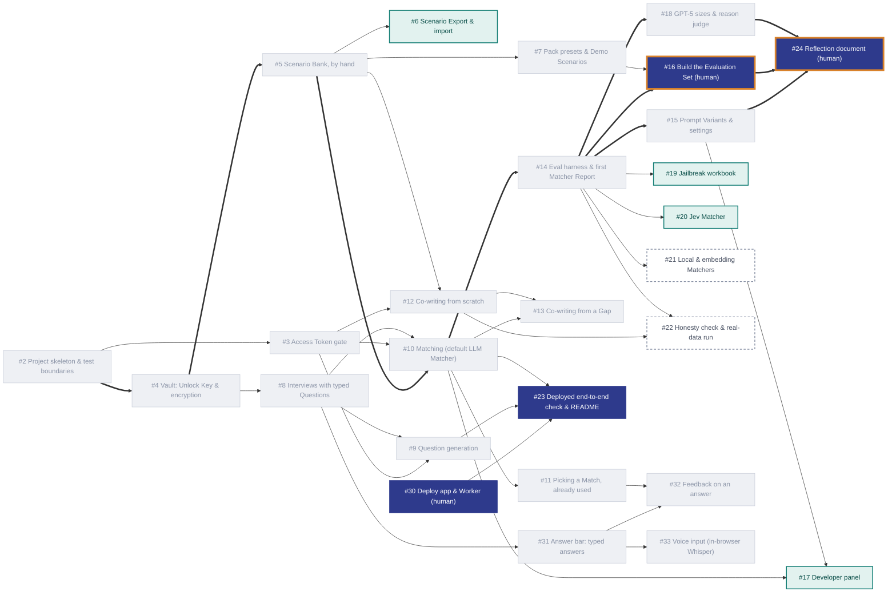

### Turing College: AI Engineering 
**Sprint 1:** Foundations of LLM Application Development

**Task:** Build an Interview Practice App

# Problem Statement

A Candidate preparing for a job interview has a handful of strong, real stories from their career, but in the moment of being asked a question they struggle to recall which story fits best, reuse the same story too often, and only discover the stories they are missing when they are already in the interview. Existing practice tools either invent generic model answers (which tempts the Candidate to claim things they never did) or require sending personal career history to a service that stores it.

This is also an educational project: the owner and a small group of fellow learners and teachers want to try it for short, time-boxed sessions, compare how well different kinds of models do the matching, and have the codebase show good practice in security, TDD and LLM evaluation on a public GitHub repo — all on a near-zero budget.

## Build Tickets 


## Running it locally

You need Node 24 or later.

```sh
npm install
cp worker/dev.vars.example worker/.dev.vars   # then fill in both values (see below)
npm run dev:worker                            # the Worker, on http://localhost:8787
npm run dev                                   # the app, on http://localhost:5173
```

`worker/.dev.vars` holds the Worker's two secrets for local development. It's gitignored, so never commit it.

| Secret | What it is |
|---|---|
| `OPENROUTER_API_KEY` | Your OpenRouter API key. Only the Worker ever sees it; it never reaches the browser. |
| `ACCESS_TOKEN_SECRET` | Any long random string, e.g. from `openssl rand -hex 32`. The Worker uses it to check Access Tokens, and you use it to mint them. |

Keep the example file's name as it is: Wrangler reads any file named `.dev.vars.<something>` as an environment's settings, and its empty values would override your real ones.

Checks: `npm run typecheck`, `npm run lint`, `npm test`. These are the same checks CI runs on every push. Tests never call a real model.

## Access Tokens

An Access Token lets a group use the app's AI features for a limited time. Minting one is a **manual step for the app owner**. It runs on your machine with a local script, so only someone who knows the Worker's `ACCESS_TOKEN_SECRET` can create tokens. There is no web page for it.

### Minting a token

```sh
npm run token -- --label cohort1              # lasts 8 hours (the default)
npm run token -- --label cohort1 --hours 24   # up to 168 hours (7 days)
```

It prints the token, for example `IH-COHORT1-1NBP7RK-PH6XVCZGFXZXAM9R`, and when it expires. Share the token with the group, who paste it into the app's **Access Token** field.

- **Label:** names the group in the Worker's usage logs, which record only label, job, model and cost. Use lowercase letters and digits only, with no hyphens: `cohort1`, not `cohort-1`.
- **Hours:** how long the token lasts, 8 by default. The Worker refuses any token that would last longer than 7 days.
- **Signing secret:** the script signs with `ACCESS_TOKEN_SECRET` from your environment, or, if that isn't set, from `worker/.dev.vars`. To mint tokens for the deployed Worker, use the same value you gave it:

  ```sh
  ACCESS_TOKEN_SECRET=<the deployed secret> npm run token -- --label cohort1
  ```

### Why the signature is 80 bits

The token's signature is HMAC-SHA256 cut to its first 80 bits. RFC 2104 §5 suggests keeping at least half the hash (128 bits), which would make the signature 26 characters instead of 16. We chose the shorter token so it can be read out or typed. To forge one, an attacker has to guess the signature by sending requests to the Worker, one guess per request, and 2^80 guesses can't happen before a token expires (7 days at most).

### Revoking tokens

Tokens can't be revoked one at a time. To end every outstanding token at once, change the Worker's `ACCESS_TOKEN_SECRET` (for the deployed Worker, `wrangler secret put ACCESS_TOKEN_SECRET`). Then mint new tokens with the new secret.
