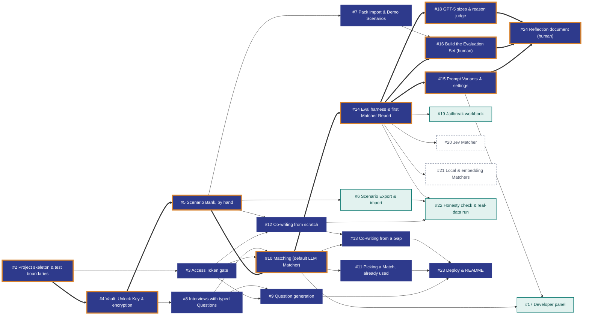

### Turing College: AI Engineering 
**Sprint 1:** Foundations of LLM Application Development

**Task:** Build an Interview Practice App

# Problem Statement

A Candidate preparing for a job interview has a handful of strong, real stories from their career, but in the moment of being asked a question they struggle to recall which story fits best, reuse the same story too often, and only discover the stories they are missing when they are already in the interview. Existing practice tools either invent generic model answers (which tempts the Candidate to claim things they never did) or require sending personal career history to a service that stores it.

This is also an educational project: the owner and a small group of fellow learners and teachers want to try it for short, time-boxed sessions, compare how well different kinds of models do the matching, and have the codebase show good practice in security, TDD and LLM evaluation on a public GitHub repo — all on a near-zero budget.

## Build Tickets 

