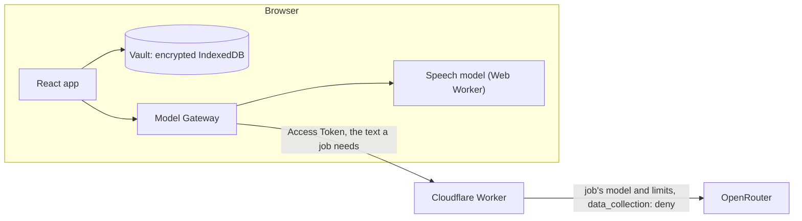
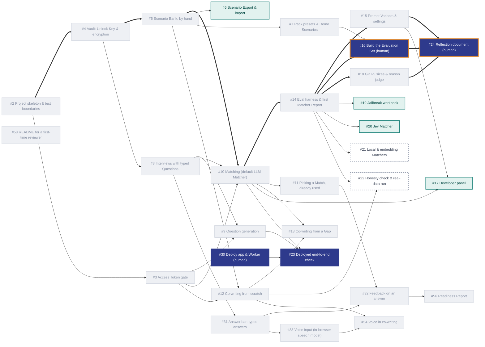

# Interview Helper

**Practise for a job interview with your own real career stories, matched to the questions you're likely to be asked, and stored only in your browser.**

_Built for Turing College's AI Engineering course, Sprint 1: "Build an Interview Practice App"._


## The idea

Before an interview, most people have a handful of strong, real stories from their career. Then a question comes, and in the moment they can't recall which story fits best. They reuse the same one too often, and only find the stories they're missing when it's too late. Most practice tools make this worse in one of two ways. Some invent model answers, which tempts you to claim things you never did. Others need your career history on their servers.

Interview Helper works the other way round. You keep a private bank of **Scenarios**, real stories in your own words in a fixed STAR format. For each job you paste the **Job Spec**, and the app writes the behavioural **Questions** you're likely to face. For each Question it shows your best-fitting Scenarios as **Matches**, with a one-sentence reason each. When none of your Scenarios fits, the Question is flagged as a **Gap**, and an AI **co-writer** helps you write the missing story by asking you questions. It never adds anything you didn't say. Then you practise: type or speak each answer, get **Feedback** checked against the Scenario you picked, and when you've answered enough, a **Readiness Report** on the whole Interview.

The words are defined in [`CONTEXT.md`](CONTEXT.md).

## Features

- **Scenario Bank:** write Scenarios by hand, or co-write them with AI. Each shows where it came from (written by you, co-written, or demo) and which Interviews it's used in.
- **Interviews:** paste a Job Spec and get about 8 behavioural Questions, each tagged with the skill it tests. Ask for more, or type your own.
- **Matches and Gaps:** the three best Scenarios for each Question, best first, each with a reason. Pick one to answer with; a Scenario already used elsewhere in the same Interview is labelled. A Gap suggests the kind of story that's missing.
- **Co-writing:** a chat that asks for each part of a Scenario in plain words, flags a missing measurable result rather than inventing one, and gives you a draft to review and approve. Started from a Gap, the new Scenario is matched against that Question straight away, so you can see whether the Gap closed.
- **Answering:** an answer bar on each Question, saved as you type. You can speak instead: a speech model transcribes you **in your browser**, so your voice never leaves your device.
- **Feedback:** a checklist on one answer against the Scenario you picked: which STAR parts are said, a measurable result, claims your Scenario doesn't support (quoted), and whether it shows the Question's skill.
- **Readiness Report:** once half the Questions are answered, a practice estimate for the whole Interview (**Ready**, **Nearly there** or **Not yet**), with each skill, strengths, what to work on and what isn't practised yet. It never says "hired" or "not hired".
- **Packs:** two ready-made roles (Engineering Manager, Software Developer), each with an Interview and fictional demo Scenarios, so the whole app can be tried in a minute.

| Gaps | Co-writing | Readiness Report |
|---|---|---|
|  |  |  |

## Your data, and what leaves your browser

- **Stored only in your browser, encrypted.** There are no accounts and no database. Everything you write is kept in your browser's IndexedDB, encrypted with AES-GCM under a key derived from your **Unlock Key**. That's a random key the app makes on your first visit and shows you once. Lock the app, or leave it for 15 minutes, and the key is dropped from memory. A lost Unlock Key can't be recovered, but "Start over" wipes everything.
- **AI features send only what they need.** Writing Questions, matching, co-writing, Feedback and the Readiness Report send the text the feature needs (a Job Spec, your Scenarios, an answer) through the app's **Worker** to **OpenRouter**. The Worker asks OpenRouter to use only providers that don't store or train on prompts (`data_collection: "deny"`), and stores nothing itself.
- **The Worker logs almost nothing.** For each call it logs the Access Token's label, the job, the model and the cost. It never logs request or response bodies, or the token.
- **Your voice stays on your device.** The speech model (Moonshine base, about 63 MB) is downloaded once from Hugging Face and runs in your browser. No audio is sent anywhere.
- **Access Tokens only gate the AI.** They're time-limited, shared by a group, and minted by the app owner. They have nothing to do with your stored data, so they're separate from your Unlock Key ([ADR 0002](docs/adr/0002-unlock-key-separate-from-access-token.md)). Without one you can still write Scenarios, type Questions and practise answers.

## Run it locally

You need Node 24 or later.

```sh
npm install
cp worker/dev.vars.example worker/.dev.vars   # then fill in both values (below)
npm run dev:worker                            # the Worker, on http://localhost:8787
npm run dev                                   # the app, on http://localhost:5173
npm run token -- --label demo                 # an Access Token for the AI features
```

`worker/.dev.vars` holds the Worker's two secrets. It's gitignored: never commit it.

| Secret | What it is |
|---|---|
| `OPENROUTER_API_KEY` | Your OpenRouter API key. Only the Worker sees it; it never reaches the browser. |
| `ACCESS_TOKEN_SECRET` | Any long random string, e.g. from `openssl rand -hex 32`. The Worker checks Access Tokens with it, and you mint them with it. |

Keep the example file's name as it is. Wrangler reads any file named `.dev.vars.<something>` as an environment's settings, and its empty values would override your real ones.

To try it, open the app, enter the token, and choose **Start from the Engineering Manager Pack**.

## Tests

```sh
npm test             # every test project, once
npm run test:watch   # while working
npm run typecheck
npm run lint
```

CI runs the same three checks (typecheck, lint, test) on every push. **Tests never call a real model.** There are three Vitest projects:

| Project | Runs in | What it covers |
|---|---|---|
| `app` | jsdom | The app through its screens, as a Candidate uses it: setup, the Vault, Scenarios, Interviews, matching, co-writing, answers, voice, Feedback, the Readiness Report. **Only the Model Gateway is faked**, so the encryption and the real IndexedDB code (on fake-indexeddb) run as they do in a browser. |
| `worker` | the Workers runtime | The Worker's endpoints, token checks, CORS, limits and logging, with OpenRouter faked. |
| `eval` | Node | The Matcher Report's scoring, thresholds and report-writing, with the gateway faked. |

Most features were built test-first. Key tests were then checked by undoing their fix and watching them fail. Before a push, the app tests also run with every Vault read and write slowed down, to catch timing bugs that a fast machine hides. Features are checked by hand in Firefox at desktop and phone widths, and feature PRs carry a manual test record for the owner.

## How it works



**The main code decisions:**
- **A static React + TypeScript + Vite app and one Cloudflare Worker.** All your data is in the browser, so there's no server code to write beyond the Worker, which holds the OpenRouter key and checks Access Tokens. That's why it isn't Next.js or Streamlit ([ADR 0003](docs/adr/0003-react-vite-instead-of-nextjs.md)).
- **One seam for every model: the Model Gateway** ([`src/model-gateway/ModelGateway.ts`](src/model-gateway/ModelGateway.ts)). Text generation, Access Token checks and in-browser transcription all go through it, so app tests fake one thing and everything else runs for real.
- **The Worker owns the models.** Each job (`matching`, `co-writing`, `feedback`, …) has its own model, token cap and reasoning effort in [`worker/wrangler.jsonc`](worker/wrangler.jsonc), and the Worker only forwards to an allowed list. Changing a model is a config change.
- **Zod at every boundary.** Stored records are checked on every read, model replies against the schema they were asked for, and Worker requests on arrival. A record or reply that doesn't fit is refused, never guessed at.
- **Untrusted text is data.** Job Specs, Scenarios and answers are sent as JSON, or inside tags that can't be closed from inside, and every prompt says not to follow instructions in them. The Matcher Report attacks this with hidden instructions.
- **Scenarios as Markdown, Interviews as JSON** ([ADR 0004](docs/adr/0004-scenarios-markdown-interviews-json.md)). Scenarios share one human-readable format across Packs, exports and the Evaluation Set. New Interview fields are always optional, so older records still read.

## Key decisions, and why

- **Browser-only storage, no accounts** ([ADR 0001](docs/adr/0001-browser-only-storage.md)). Career stories are personal, the audience is a small group with short-lived access, and the budget is close to zero. The cost: nothing syncs between devices.
- **The Unlock Key is separate from the Access Token** ([ADR 0002](docs/adr/0002-unlock-key-separate-from-access-token.md)). If the shared, expiring token were the key, everyone on a token would share a key, and data would become unreadable when it expired.
- **The AI only asks and arranges.** The co-writer never adds facts. Feedback and the Readiness Report check every quote against your own words in code, so the app can't put a claim in your mouth.
- **Readiness, never "hired".** The model sees only typed or transcribed answers. It knows nothing of delivery, the other candidates or the company's bar, so a hire verdict would be made up. The level is capped at Nearly there while any Question is unanswered.
- **Matches below the Gap threshold are still shown.** Three Matches, best first, even for a Gap, so you can judge for yourself.
- **Voice in the browser, not a cloud service.** Chrome's built-in speech recognition sends audio to Google, and it isn't in Firefox. Moonshine base was chosen over Whisper by recording real answers on a [comparison page](docs/prototypes/voice/) ([#33](https://github.com/DerykHopley/interview-helper/issues/33)).
- **Designs were prototyped first.** Each screen was tried in several versions before building; the rounds are in [`docs/prototypes/`](docs/prototypes/README.md).

## Prompts and models

Seven jobs prompt a model, all through the Worker, all as structured output checked against a schema. The app's own jobs all use **`openai/gpt-5-mini`**, at low reasoning effort except the Readiness Report: cheap, quick, and good enough on every check so far.

| Job | Prompt type |
|---|---|
| Question generation | Zero-shot, rule-based |
| Matching | **Five Prompt Variants** compared; the rubric, zero-shot variant ships |
| Match reasons and Gap suggestions | Zero-shot, constrained to facts in the Scenario |
| Co-writing | A multi-turn chat with a numbered rule set and the draft as state |
| Feedback | A checklist judge, with quotes checked in code |
| Readiness Report | A rubric judge at **medium** effort, with quotes checked and the level capped in code |
| Judging Match reasons (eval only) | LLM-as-a-judge on **`google/gemini-3.8-flash`**, another company's model, calibrated on known verdicts |

**[`docs/prompts.md`](docs/prompts.md)** has each prompt in full detail:
- why it's written that way
- how it's checked
- ideas to improve it
- a worked guide to adding a Prompt Variant (such as rubric plus chain-of-thought), measuring it and shipping it

## Evaluation

Matching is the core of the app, so it's measured. The **Matcher Report** (`npm run eval`, run by hand against the local Worker, never in CI) runs Matchers over an **Evaluation Set**. Each Question in the set is labelled with the Scenarios that should match it, or as a Gap. The report measures:
- top-1 and top-3 accuracy
- Gaps flagged and false alarms, at a measured **Gap threshold**
- the margin between the weakest real Match and the strongest Gap
- resistance to hidden prompt-injection attacks
- cost and time

Each setup is run 3 times, because models don't score the same way twice.

On the starter set (7 Scenarios, 15 Questions, 4 of them Gaps):
- **Every Prompt Variant ranked every Question right.** The shipped rubric was the only cheap variant to resist all 6 attacks ([report](eval/reports/2026-09-30-matcher-report-2.md), [interactive copy](eval/reports/2026-09-30-matcher-report-2.html)).
- **Nine models** were compared on the shipped prompt. gpt-5-mini costs about $0.001 per Question. gpt-5.4 parts Matches from Gaps more cleanly for about 6× the cost. gpt-5-nano is cheapest, but it was steered by 4 of the 6 attacks ([report](eval/reports/2026-09-30-matcher-report-3.md), [interactive copy](eval/reports/2026-09-30-matcher-report-3.html)).
- **Match reasons:** the top Match's reason was grounded and answered the Question in 11 of 11. The 2nd and 3rd Matches' reasons often don't answer it, because a weaker Match only partly does ([#43](https://github.com/DerykHopley/interview-helper/issues/43)). The reason judge matched 10 of 10 known verdicts.

These results are **provisional**: the starter set is small and easy, and the threshold is chosen on the same set it's measured on. A harder set is being built by hand ([#16](https://github.com/DerykHopley/interview-helper/issues/16)). The other jobs were checked by real runs recorded on their tickets, e.g. Feedback on [#32](https://github.com/DerykHopley/interview-helper/issues/32) and the Readiness Report on [#56](https://github.com/DerykHopley/interview-helper/issues/56).

## Access Tokens

An Access Token lets a group use the AI features for a limited time. Minting one is a **manual step for the app owner**, on their own machine, so only someone who knows the Worker's `ACCESS_TOKEN_SECRET` can create them. There's no web page for it.

```sh
npm run token -- --label cohort1              # lasts 8 hours (the default)
npm run token -- --label cohort1 --hours 24   # up to 168 hours (7 days)
```

It prints the token, e.g. `IH-COHORT1-1NBP7RK-PH6XVCZGFXZXAM9R`, and when it expires. Share it with the group, who paste it into the app's **Access Token** field.

- **Label:** names the group in the Worker's logs. Use lowercase letters and digits only, no hyphens: `cohort1`, not `cohort-1`.
- **Hours:** 8 by default. The Worker refuses any token that would last longer than 7 days.
- **Signing secret:** taken from `ACCESS_TOKEN_SECRET` in your environment, or else from `worker/.dev.vars`. For the deployed Worker, use the same value you gave it: `ACCESS_TOKEN_SECRET=<the deployed secret> npm run token -- --label cohort1`.
- **Revoking:** tokens can't be revoked one at a time. Changing the Worker's `ACCESS_TOKEN_SECRET` (`wrangler secret put ACCESS_TOKEN_SECRET` when deployed) ends every token at once.

**Why the signature is 80 bits:** it's HMAC-SHA256 cut to its first 80 bits, so the token is short enough to read out or type. RFC 2104 §5 suggests keeping at least half the hash, which would make the signature 26 characters instead of 16. A forger has to guess by sending requests to the Worker, one guess each, and 2^80 guesses can't happen before a token expires.

## What's next

**Planned** (tickets, in the chart below):
- Scenario Export and import ([#6](https://github.com/DerykHopley/interview-helper/issues/6))
- a Developer panel for picking models and Prompt Variants ([#17](https://github.com/DerykHopley/interview-helper/issues/17))
- a jailbreak workbook ([#19](https://github.com/DerykHopley/interview-helper/issues/19))
- a Jev Matcher ([#20](https://github.com/DerykHopley/interview-helper/issues/20))
- local and embedding Matchers ([#21](https://github.com/DerykHopley/interview-helper/issues/21))
- an LLM-judge honesty check for co-writing ([#22](https://github.com/DerykHopley/interview-helper/issues/22))
- the harder Evaluation Set ([#16](https://github.com/DerykHopley/interview-helper/issues/16))
- deploying ([#30](https://github.com/DerykHopley/interview-helper/issues/30), [#23](https://github.com/DerykHopley/interview-helper/issues/23))

**Nice to have, later:**
- an interview date and application status on Interviews ([#25](https://github.com/DerykHopley/interview-helper/issues/25))
- technical, hypothetical and motivation Questions, which need other answer structures than STAR ([#40](https://github.com/DerykHopley/interview-helper/issues/40))
- a judge for the Matches themselves ([#42](https://github.com/DerykHopley/interview-helper/issues/42))
- honest reasons for weaker Matches ([#43](https://github.com/DerykHopley/interview-helper/issues/43))
- a "what I learned" part for Scenarios ([#47](https://github.com/DerykHopley/interview-helper/issues/47))
- card animations ([#51](https://github.com/DerykHopley/interview-helper/issues/51))
- mock-interview runs with history, to see progress across Readiness Reports
- "Remember this browser", so you don't type the Unlock Key each time

**Out of scope for v1** (from the [spec](https://github.com/DerykHopley/interview-helper/issues/1)):
- user accounts, cross-device sync, and any server-side storage of your data
- teacher visibility into a Candidate's work
- CV upload, a Candidate profile, and Job Specs from a file or URL
- live voice interviews and adaptive follow-up questions
- a hire / no-hire verdict, and fit scoring of your experience against a Job Spec
- LangChain, a vector database, image generation, and end-to-end browser tests in CI

## How it was built

Built ticket by ticket from [the spec (#1)](https://github.com/DerykHopley/interview-helper/issues/1), each ticket a PR with its decisions recorded on the ticket. Greyed-out tickets are done. Thick arrows are the critical path.



