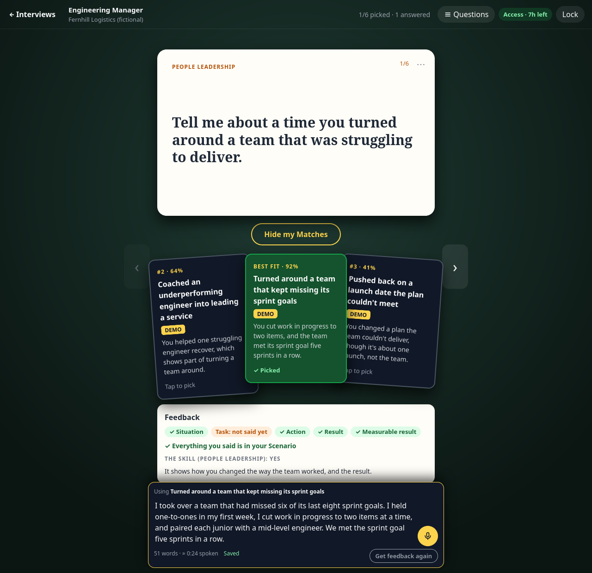
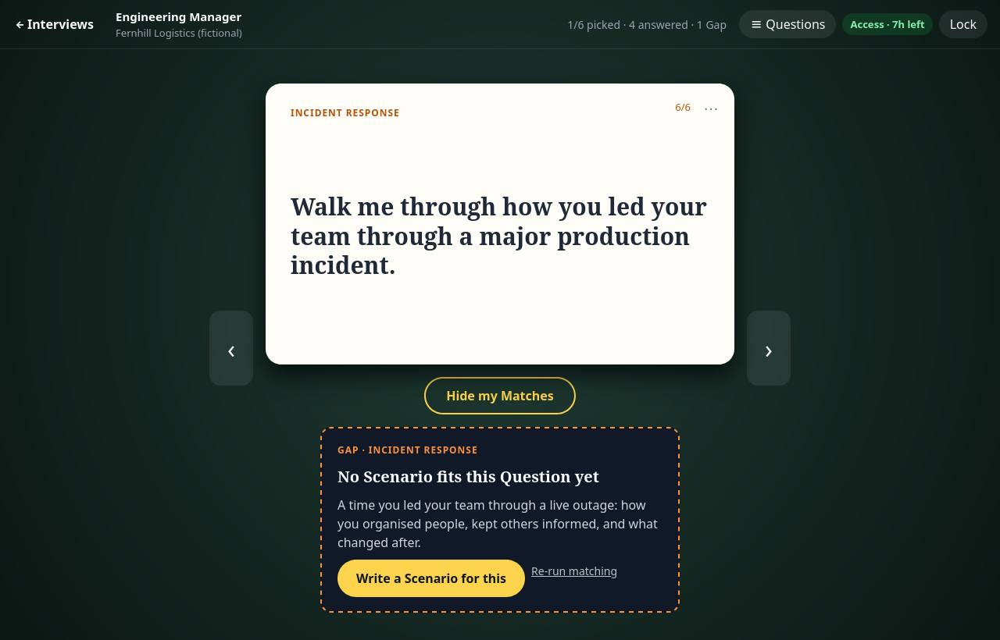
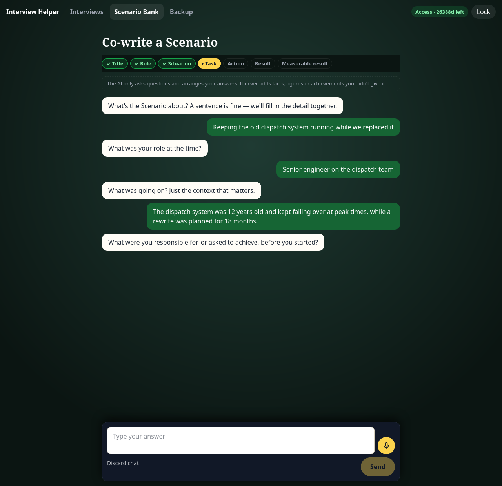
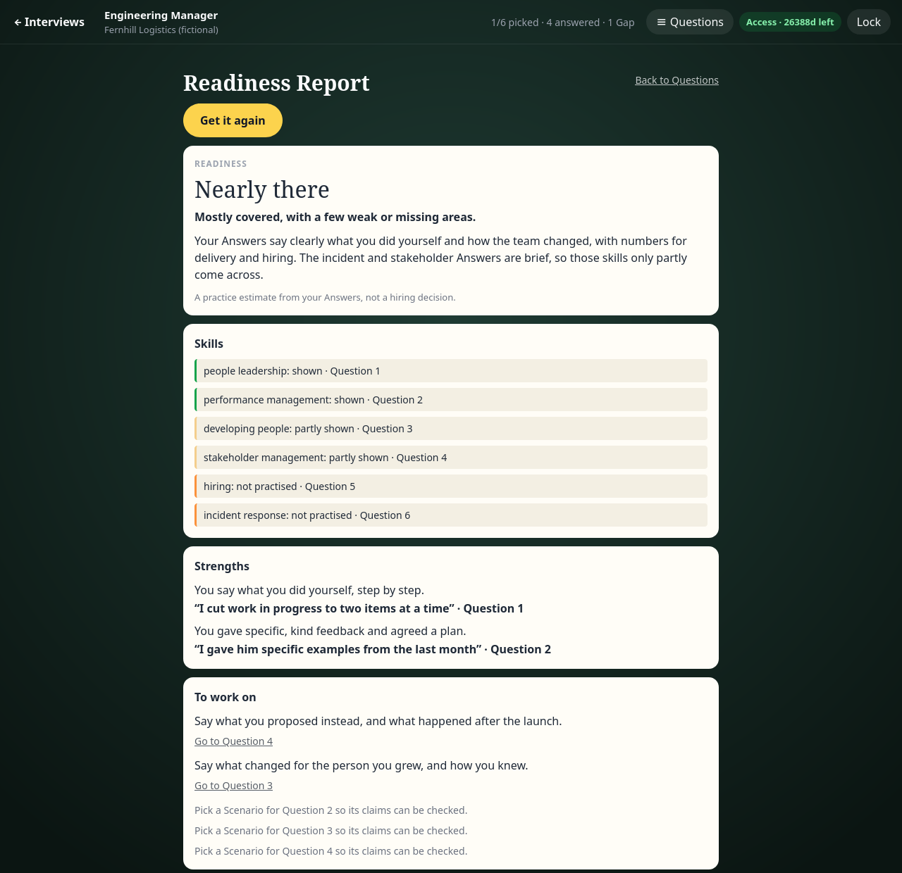
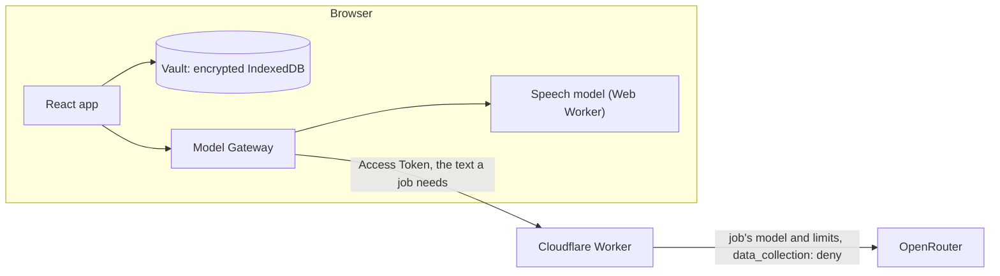
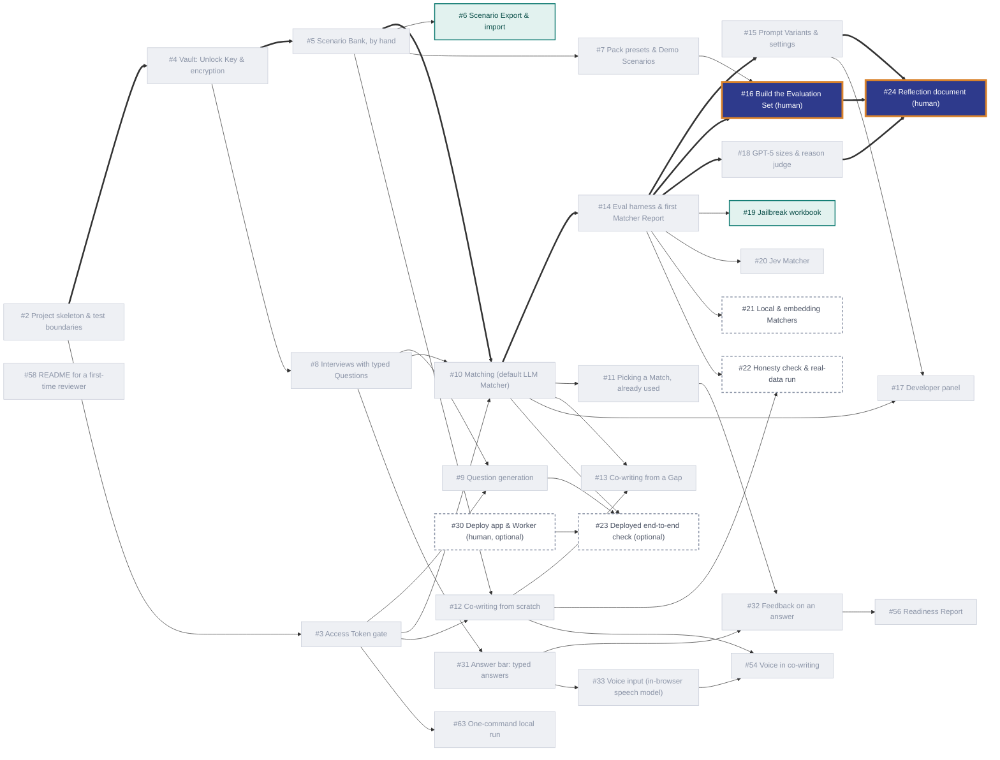

# Interview Helper

**Practise for a job interview with your own real career stories, matched to the questions you're likely to be asked, and stored only in your browser.**

_Built for Turing College's AI Engineering course, Sprint 1: "Build an Interview Practice App". Ticket and PR numbers like #56 refer to [github.com/DerykHopley/interview-helper](https://github.com/DerykHopley/interview-helper), where the spec, tickets, decisions, reviews and manual test records are. Where each part of the brief is met is under [The course brief: what's met](#the-course-brief-whats-met)._



**Contents**
- [The idea](#the-idea)
- [Features](#features)
- [Your data, and what leaves your browser](#your-data-and-what-leaves-your-browser)
- [How it works](#how-it-works)
- [Key decisions, and why](#key-decisions-and-why)
- [Prompts and models](#prompts-and-models)
- [Evaluation](#evaluation)
- [Run it locally](#run-it-locally)
- [Tests](#tests)
- [Access Tokens](#access-tokens)
- [The course brief: what's met](#the-course-brief-whats-met)
- [What's next](#whats-next)
- [How it was built](#how-it-was-built)

## The idea

Before an interview, most people have a handful of strong, real stories from their career. Then a question comes, and in the moment they can't recall which story fits best. They reuse the same one too often, and only find the stories they're missing when it's too late. Most practice tools make this worse in one of two ways. Some invent model answers, which tempts you to claim things you never did. Others need your career history on their servers.

Interview Helper works the other way round. You keep a private bank of **Scenarios**, real stories in your own words in a fixed STAR format. For each job you paste the **Job Spec**, and the app writes the behavioural **Questions** you're likely to face. For each Question it shows your best-fitting Scenarios as **Matches**, with a one-sentence reason each. When none of your Scenarios fits, the Question is flagged as a **Gap**, and an AI **co-writer** helps you write the missing story by asking you questions. It never adds anything you didn't say. Then you practise: type or speak each **Answer**, get **Feedback** checked against the Scenario you picked, and when you've answered enough, a **Readiness Report** on the whole Interview.

The words are defined in [`CONTEXT.md`](CONTEXT.md).

## Features

- **Scenario Bank:** write Scenarios by hand, or co-write them with AI. Each shows where it came from (written by hand, co-written, or a Demo Scenario) and which Interviews it's picked in.
- **Interviews:** paste a Job Spec and get about 8 behavioural Questions, each tagged with the skill it tests. Ask for more, or type your own.
- **Matches and Gaps:** the three best Scenarios for each Question, best first, each with a reason. Pick one to answer with; a Scenario already picked elsewhere in the same Interview is labelled. A Gap shows no Matches, but suggests the kind of story that's missing.
- **Co-writing:** a chat that asks for each part of a Scenario in plain words, flags a missing measurable result rather than inventing one, and gives you a draft to review and approve. Started from a Gap, the new Scenario is matched against that Question straight away, so you can see whether the Gap closed.
- **Answering:** an answer bar on each Question, saved as you type. You can speak instead: a speech model transcribes you **in your browser**, so your voice never leaves your device.
- **Feedback:** a checklist on one Answer against the Scenario you picked: which STAR parts are said, a measurable result, claims your Scenario doesn't support (quoted), and whether it shows the Question's skill.
- **Readiness Report:** once half the Questions are answered, a practice estimate for the whole Interview (**Ready**, **Nearly there** or **Not yet**), with each skill, strengths, what to work on and what isn't practised yet.
- **Developer panel** (for the app owner): press **Ctrl+Shift+D**, or add `?dev=1` to the address, and a DEV tab appears. For each job you can pick the model (with OpenRouter's live prices), the temperature where the model takes one, max tokens up to the job's cap, and the reasoning effort. Matching offers only the Setups the Matcher Report measured, Jev's included. A Calls tab shows each call's tokens, time and billed cost. It needs an Access Token, and the settings stay in that browser.
- **Packs:** two ready-made roles (Engineering Manager, Software Developer), each with an Interview and fictional Demo Scenarios, so the whole app can be tried in a minute.

| Gaps | Co-writing | Readiness Report |
|---|---|---|
|  |  |  |

## Your data, and what leaves your browser

- **Stored only in your browser, encrypted.** There are no accounts and no database. Everything you write is kept in your browser's IndexedDB, encrypted with AES-GCM under a key derived from your **Unlock Key**. That's a random key the app makes on your first visit and shows you once. Lock the app, or leave it for 15 minutes, and the key is dropped from memory. A lost Unlock Key can't be recovered, but "Start over" wipes everything.
- **AI features send only what they need.** Writing Questions, matching, co-writing, Feedback and the Readiness Report send the text the feature needs (a Job Spec, your Scenarios, an Answer) through the app's **Worker** to **OpenRouter**. The Worker asks OpenRouter to use only providers that don't store or train on prompts (`data_collection: "deny"`). The Worker keeps no data; it only passes the call on.
- **The Worker logs almost nothing.** For each call it logs the Access Token's label, the job, the model and the cost, and for a failed call OpenRouter's error status and message. It never logs request or response bodies, or the token. The log lines go to Cloudflare Workers Logs.
- **Your voice stays on your device.** The speech model (Moonshine base, about 63 MB) runs in your browser. It's downloaded once from Hugging Face, and its runtime from the jsDelivr CDN; no audio is sent to either.
- **Access Tokens only gate the AI.** They're time-limited, shared by a group, and minted by the app owner. They have nothing to do with your stored data, so they're separate from your Unlock Key ([ADR 0002](docs/adr/0002-unlock-key-separate-from-access-token.md)). Without one you can still write Scenarios, type Questions and practise Answers.

## How it works



**The main code decisions:**
- **A static React + TypeScript + Vite app and one Cloudflare Worker.** All your data is in the browser, so there's no server code to write beyond the Worker, which holds the OpenRouter key and checks Access Tokens. That's why it isn't Next.js or Streamlit ([ADR 0003](docs/adr/0003-react-vite-instead-of-nextjs.md)).
- **One interface for every model: the Model Gateway** ([`src/model-gateway/ModelGateway.ts`](src/model-gateway/ModelGateway.ts)). Text generation, Access Token checks and in-browser transcription all go through it. Tests swap in a fake gateway, and everything else runs for real.
- **The Worker owns the models.** Each job (`matching`, `co-writing`, `feedback`, …) has its own model, token cap and reasoning effort in [`worker/wrangler.jsonc`](worker/wrangler.jsonc), and the Worker only forwards to an allowed list. Changing a model is a config change.
- **Zod at every boundary.** Stored records are checked on every read, model replies against the schema they were asked for, and Worker requests on arrival. A record or reply that doesn't fit is refused, never guessed at.
- **Untrusted text is data.** Job Specs, Scenarios and Answers are sent as JSON, or inside tags that can't be closed from inside, and every prompt says not to follow instructions in them. The Matcher Report tests this with hidden instructions (adversarial cases).
- **Scenarios as Markdown, Interviews as JSON** ([ADR 0004](docs/adr/0004-scenarios-markdown-interviews-json.md)). Scenarios share one human-readable format across Packs and the Evaluation Set. New Interview fields are always optional, so older records still read.

## Key decisions, and why

- **Browser-only storage, no accounts** ([ADR 0001](docs/adr/0001-browser-only-storage.md)). Career stories are personal, the audience is a small group with short-lived access, and the budget is close to zero. The cost: nothing syncs between devices.
- **The Unlock Key is separate from the Access Token** ([ADR 0002](docs/adr/0002-unlock-key-separate-from-access-token.md)). If the shared, expiring token were the key, everyone on a token would share a key, and data would become unreadable when it expired.
- **The AI only asks and arranges.** The co-writer never adds facts. Feedback and the Readiness Report check every quote against your own words in code, so the app can't put a claim in your mouth.
- **Readiness, never "hired".** The model sees only typed or transcribed Answers. It knows nothing of delivery, the other candidates or the company's bar, so a hire verdict would be made up. The level is capped at Nearly there while any Question is unanswered.
- **Voice in the browser, not a cloud service.** Chrome's built-in speech recognition sends audio to Google, and it isn't in Firefox. Moonshine base was chosen over Whisper by recording real Answers on a [comparison page](docs/prototypes/voice/) ([#33](https://github.com/DerykHopley/interview-helper/issues/33)).
- **Designs were prototyped first.** Each screen was tried in several versions before building; the rounds are in [`docs/prototypes/`](docs/prototypes/README.md).

## Prompts and models

Seven jobs prompt a model, all through the Worker, all as structured output checked against a schema. The app's own jobs all use **`openai/gpt-5-mini`**, at low reasoning effort except the Readiness Report. It's cheap and quick, and it held up against larger models in the comparison under [Evaluation](#evaluation).

| Job | Prompt type |
|---|---|
| Question generation | Zero-shot, rule-based |
| Matching | **Five Prompt Variants** compared; the rubric, zero-shot variant ships |
| Match reasons and Gap suggestions | Zero-shot, constrained to facts in the Scenario |
| Co-writing | A multi-turn chat with a numbered rule set and the draft as state |
| Feedback | A checklist judge, with quotes checked in code |
| Readiness Report | A rubric judge at **medium** effort, with quotes checked and the level capped in code |
| Judging Match reasons (eval only) | LLM-as-a-judge on **`google/gemini-3.8-flash`**, another company's model, calibrated on known verdicts |

**Ideas to improve them:**
- Try the rubric with chain-of-thought for matching. `docs/prompts.md` walks through adding it and measuring it.
- Let reasons for weaker Matches say honestly that they only partly answer the Question ([#43](https://github.com/DerykHopley/interview-helper/issues/43)).
- Add an LLM-judge honesty check for co-writing ([#22](https://github.com/DerykHopley/interview-helper/issues/22)).

**[`docs/prompts.md`](docs/prompts.md)** has each prompt in full detail:
- why it's written that way
- how it's checked
- more ideas to improve it
- a worked guide to adding a Prompt Variant, measuring it and shipping it

## Evaluation

Matching is the core of the app, so it's measured. The **Matcher Report** (`npm run eval`, run by hand against the local Worker, never in CI) runs Matchers over an **Evaluation Set**: Scenarios and Questions, each Question labelled with the Scenarios that should match it, or as a Gap.

Each Setup (an LLM's Prompt Variant, model and effort, or how Jev is asked) runs 3 times, because models don't score the same way twice. The report measures:
- **Top-1 and top-3 accuracy:** is a right Scenario ranked first, or in the first three?
- **The Gap threshold:** the score below which a Question counts as a Gap. It's measured for each Setup, as the cut-off that sorts the most Questions correctly.
- **Gaps flagged and false alarms** at that threshold.
- **The margin:** how far apart the weakest real Match and the strongest Gap score. The bigger it is, the safer the threshold.
- **Adversarial cases:** Questions run again with hidden instructions added, to see whether they steer the Matcher.
- **Cost and time.**

On the starter set (7 Scenarios, 15 Questions, 4 of them Gaps, and 2 adversarial cases):
- **Every Prompt Variant ranked every Question right.** The shipped rubric was the only cheap variant that neither adversarial case steered in any run ([report](eval/reports/2026-09-30-matcher-report-2.md), [interactive copy](eval/reports/2026-09-30-matcher-report-2.html)).
- **Nine models** were compared on the shipped prompt. gpt-5-mini costs about $0.001 per Question. gpt-5.4 had a much wider margin for about 6× the cost. gpt-5-nano costs a fifth as much as gpt-5-mini, but hidden instructions steered it in 4 of its 6 attacked runs ([report](eval/reports/2026-09-30-matcher-report-3.md), [interactive copy](eval/reports/2026-09-30-matcher-report-3.html)).
- **Jev** ([#20](https://github.com/DerykHopley/interview-helper/issues/20)), TypeSafe's decision model, answers typed questions with probabilities instead of text. It was asked two ways, each in one call per Question: one choice among all the Scenarios, or yes or no for each. Both got every Question right, at about a ninth of gpt-5-mini's cost and 0.3 s instead of 6 s. Asked as a choice, it puts nearly all its probability on one Scenario, so the 2nd and 3rd Matches would carry little signal. It's for comparison; the app still ships gpt-5-mini ([report](eval/reports/2026-10-05-matcher-report.md), [interactive copy](eval/reports/2026-10-05-matcher-report.html)).
- **Match reasons:** the top Match's reason was grounded and answered the Question in 11 of 11. The 2nd and 3rd Matches' reasons often don't answer it, because a weaker Match only partly does ([#43](https://github.com/DerykHopley/interview-helper/issues/43)). The reason judge matched 10 of 10 known verdicts.

These results are **provisional**: the starter set is small and easy, and the threshold is chosen on the same set it's measured on. A harder set is being built by hand ([#16](https://github.com/DerykHopley/interview-helper/issues/16)). The other jobs were checked by real runs recorded on GitHub:
- co-writing chats on [PR #46](https://github.com/DerykHopley/interview-helper/pull/46) and [#22](https://github.com/DerykHopley/interview-helper/issues/22)
- Feedback on [PR #52](https://github.com/DerykHopley/interview-helper/pull/52)
- the Readiness Report on [#56](https://github.com/DerykHopley/interview-helper/issues/56)

## Run it locally

You need Node 24 or later, and **your own OpenRouter API key** ([openrouter.ai/keys](https://openrouter.ai/keys)) for the AI features. Everything else (the Vault, Scenarios, Packs, Answers, voice) works without one.

```sh
npm install
npm run local
```

The first time, it asks for your OpenRouter key (what you type isn't shown) and saves it in `worker/.dev.vars`, which is gitignored, with a signing secret it makes up. Then it starts the Worker and the app together and mints an Access Token for this machine. When it says it's ready, open **http://localhost:5173**: the token is already filled in, so press **Continue**, then choose **Start from the Engineering Manager Pack**. Ctrl+C in that terminal stops both.

Later runs don't ask again: they reuse `worker/.dev.vars` (filling in anything missing, if you made it by hand) and mint a new token, which lasts 7 days. If your saved token has expired, the app asks for it again with the new one filled in. Without a terminal to type into, it reads the key from `OPENROUTER_API_KEY`.

<details>
<summary>Running the two parts yourself</summary>

```sh
cp worker/dev.vars.example worker/.dev.vars   # then fill in both values (the file says what they are)
npm run dev:worker                            # the Worker, on http://localhost:8787
npm run dev                                   # the app, on http://localhost:5173
npm run token -- --label demo                 # an Access Token, to paste into the app
```

</details>

## Tests

```sh
npm test             # every test project, once
npm run test:watch   # while working
npm run typecheck
npm run lint
```

CI runs the same three checks (typecheck, lint, test) on every push. **Tests never call a real model.** There are four Vitest projects:

| Project | Runs in | What it covers |
|---|---|---|
| `app` | jsdom | The app through its screens, as a Candidate uses it: setup, the Vault, Scenarios, Interviews, matching, co-writing, Answers, voice, Feedback, the Readiness Report. **Only the Model Gateway is faked.** The encryption and storage code run as they do in a browser, on an in-memory IndexedDB. |
| `worker` | the Workers runtime | The Worker's endpoints, token checks, CORS, limits and logging, with OpenRouter faked. |
| `eval` | Node | The Matcher Report's scoring, thresholds and report-writing, with the gateway faked. |
| `scripts` | Node | `npm run local`'s setup: the secrets file and the hidden key prompt. |

Most features were built test-first. Key tests were then checked by undoing their fix and watching them fail. Features are checked by hand in Firefox at desktop and phone widths, and feature PRs carry a manual test record for the owner.

## Access Tokens

An Access Token lets a group use the AI features for a limited time (8 hours by default, 7 days at most). `npm run local` mints one for you. For a group, the app owner mints them on their own machine:

```sh
npm run token -- --label cohort1
```

[`docs/access-tokens.md`](docs/access-tokens.md) covers the options, tokens for the deployed Worker, revoking them all, and why the signature is 80 bits.

## The course brief: what's met

Checked against the Sprint 1 brief on 2026-10-02.

**Required: all met.**

| Requirement | Where it's met |
|---|---|
| Research the kind of interview prep | Matching your own real Scenarios to likely Questions, from [the spec (#1)](https://github.com/DerykHopley/interview-helper/issues/1) and the [prototypes](docs/prototypes/README.md) |
| A front-end (Streamlit or Next.js) | React + Vite instead. [ADR 0003](docs/adr/0003-react-vite-instead-of-nextjs.md) records why, and that the course confirmed Next.js was optional |
| An OpenRouter API key | Held by the Worker only, never sent to the browser |
| A model from the list (gpt-5-mini, gpt-5-nano, gpt-5) | `openai/gpt-5-mini` for every app job. gpt-5-nano was compared in the Matcher Report; plain gpt-5 isn't on the owner's allow-list, so gpt-5.4 stood in for the full size |
| At least 5 system prompts with different techniques, compared | Matching's five Prompt Variants (zero-shot, few-shot, chain-of-thought, persona, rubric), compared in the Matcher Report. See [Prompts and models](#prompts-and-models) |
| At least one security guard | Access Tokens; untrusted text sent as data, with prompts told not to follow it; schema-checked replies; quotes checked in code; adversarial cases in the Matcher Report |

**Optional tasks done.** The bonus asks for at least 2 medium and 1 hard.

| Task | Where it's met |
|---|---|
| Easy 1: a critique of the solution | A two-axis review (standards and spec) on every ticket's PR, by Claude rather than ChatGPT |
| Easy 3: input validation | Zod at every boundary: stored records, model replies, Worker requests |
| Easy 6: structured evaluation criteria | Feedback's checklist and the Readiness Report's rubric |
| Easy 8: tune a setting and compare | Reasoning effort, compared in the Matcher Report |
| Medium 1: all model settings as fields | The Developer panel: model, temperature, max tokens and reasoning effort for each job. It's for the app owner, not the Candidate, as Medium 9 asks |
| Medium 2: two or more structured JSON outputs | Every job replies as JSON checked against its own schema |
| Medium 3: the price of the prompt | The Developer panel shows each model's live price per million tokens from OpenRouter's models endpoint, and each call's cost as billed by OpenRouter. It shows the billed cost rather than working it out from the prices |
| Medium 4: your own improvement from the OpenRouter docs | `data_collection: "deny"`, and structured outputs with JSON Schema |
| Medium 6: a Job Spec field | Each Interview is built from a pasted Job Spec |
| Medium 7: choosing from a list of LLMs | The Developer panel's model list: OpenAI, Google, Anthropic and MiniMax models |
| Medium 9: developer settings separate from the user experience | The Developer panel is hidden until Ctrl+Shift+D or `?dev=1`, and styled so it's never mistaken for the Candidate's screens |
| Hard 1: a full chatbot | Co-writing, a multi-turn chat that builds a Scenario |
| Hard 4: open-source LLMs | The open-weight `google/gemma-4-31b-it` was measured in the Matcher Report, and can be picked for any job in the Developer panel, matching included. It isn't the default |
| Hard 5: LLM-as-a-judge | The Match reason judge, on another company's model, calibrated against known verdicts |

**Planned:**
- Medium 5: the jailbreak experiment as an Excel workbook ([#19](https://github.com/DerykHopley/interview-helper/issues/19))
- Hard 4, more clearly: local and embedding Matchers ([#21](https://github.com/DerykHopley/interview-helper/issues/21))

**Not planned:**
- Easy 2, 4, 5 and 7: domain-tuned prompts, difficulty levels, concise or detailed replies, and interviewer personas. The app's Questions follow the Job Spec instead.
- Medium 8: image generation
- Hard 2 and 3: LangChain and a vector database. Both are out of scope in the spec, and the brief brings them in at Sprint 2.

## What's next

**Planned** (tickets, in the chart below):
- Scenario Export and import, to back up or move Scenarios between browsers ([#6](https://github.com/DerykHopley/interview-helper/issues/6))
- the adversarial results in a workbook for the course's jailbreak experiment ([#19](https://github.com/DerykHopley/interview-helper/issues/19))
- local and embedding Matchers ([#21](https://github.com/DerykHopley/interview-helper/issues/21))
- an LLM-judge honesty check for co-writing ([#22](https://github.com/DerykHopley/interview-helper/issues/22))
- the harder Evaluation Set ([#16](https://github.com/DerykHopley/interview-helper/issues/16))
- deploying, now optional since reviewers run it locally ([#30](https://github.com/DerykHopley/interview-helper/issues/30), [#23](https://github.com/DerykHopley/interview-helper/issues/23))

**Nice to have, later:**
- an interview date and application status on Interviews ([#25](https://github.com/DerykHopley/interview-helper/issues/25))
- technical, hypothetical and motivation Questions, which need other answer structures than STAR ([#40](https://github.com/DerykHopley/interview-helper/issues/40))
- a judge for the Matches themselves ([#42](https://github.com/DerykHopley/interview-helper/issues/42))
- honest reasons for weaker Matches ([#43](https://github.com/DerykHopley/interview-helper/issues/43))
- a "what I learned" part for Scenarios ([#47](https://github.com/DerykHopley/interview-helper/issues/47))
- card animations ([#51](https://github.com/DerykHopley/interview-helper/issues/51))
- mock-interview runs with history, to see progress across Readiness Reports

**Out of scope for v1** (from the [spec](https://github.com/DerykHopley/interview-helper/issues/1)):
- user accounts, cross-device sync, and any server-side storage of your data
- teacher visibility into a Candidate's work
- CV upload, a Candidate profile, or scoring your experience against a job
- Job Specs from a file or URL
- "Remember this browser", so you don't type the Unlock Key each time
- live voice interviews and adaptive follow-up questions
- LangChain, a vector database, image generation, and end-to-end browser tests in CI

## How it was built

Built ticket by ticket from [the spec (#1)](https://github.com/DerykHopley/interview-helper/issues/1), each ticket a PR with its decisions recorded on the ticket. [`docs/workflow.md`](docs/workflow.md) describes the workflow: Claude Code with Matt Pocock's skills, and the checks each ticket went through. Greyed-out tickets are done. Thick arrows are the critical path. Dashed boxes are Coulds, the optional ones.



